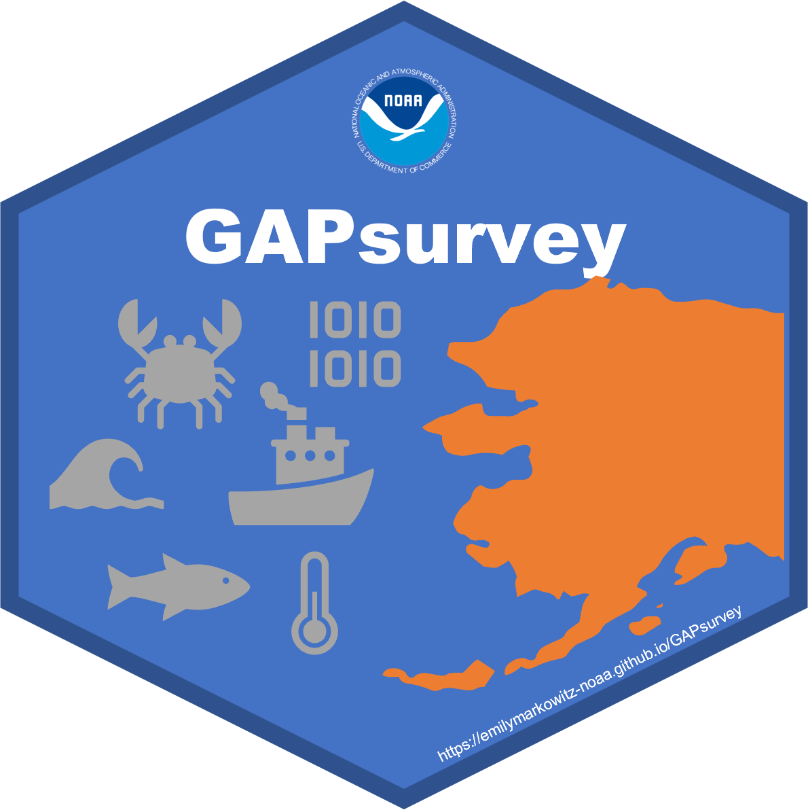

<!-- README.md is generated from README.Rmd. Please edit that file -->

# GAPsurvey <a href={https://afsc-gap-products.github.io/GAPsurvey}>

*At-sea data management tools for RACE GAP surveys*

> This code is always in development

## This code is primarally maintained by:

**Emily Markowitz** (Emily.Markowitz AT noaa.gov;
(**EmilyMarkowitz-NOAA?**))

**Sean Rohan** (Sean.Rohan AT noaa.gov; (**sean-rohan-NOAA?**))

**Margaret Siple** (Margaret Siple AT noaa.gov;
(**MargaretSiple-NOAA?**))

Alaska Fisheries Science Center,

National Marine Fisheries Service,

National Oceanic and Atmospheric Administration,

Seattle, WA 98195

## Table of contents

> - [*Make sure the necessary packages are
>   installed*](#make-sure-the-necessary-packages-are-installed)
> - [*example, the user may have a different
>   path*](#example,-the-user-may-have-a-different-path)
>   - [*User Resources*](#user-resources)
>   - [*Cite this data*](#cite-this-data)
> - [*Relevant publications*](#relevant-publications)
> - [*Suggestions and Comments*](#suggestions-and-comments)
>   - [*R Version Metadata*](#r-version-metadata)
>   - [*NOAA README*](#noaa-readme)
>   - [*NOAA License*](#noaa-license)

## Make sure the necessary packages are installed

``` r
library(devtools)

devtools::install_github("afsc-gap-products/GAPsurvey")
 # Or
remotes::install_github("afsc-gap-products/GAPsurvey@main")

library(GAPsurvey)
```

or install from local file `.tar.gz`:

``` r
# example, the user may have a different path
install.packages('C:/Users/User/Downloads/GAPsurvey_2025.05.13.tar.gz',
                 repos=NULL, type='source')
library(GAPsurvey)
```

## User Resources

- [GitHub
  repository](https://github.com/afsc-gap-products/gap_products).

- [Access Tips and Documentation for All Production
  Data](https://afsc-gap-products.github.io/gap_products/)

- [Fisheries One Stop Shop (FOSS)](https://www.fisheries.noaa.gov/foss)

- [Groundfish Assessment Program Bottom Trawl
  Surveys](https://www.fisheries.noaa.gov/alaska/science-data/groundfish-assessment-program-bottom-trawl-surveys)

- [AFSC’s Resource Assessment and Conservation Engineering
  Division](https://www.fisheries.noaa.gov/about/resource-assessment-and-conservation-engineering-division)

- [Survey code
  books](https://www.fisheries.noaa.gov/resource/document/groundfish-survey-species-code-manual-and-data-codes-manual)

- [Publications and Data Reports](https://repository.library.noaa.gov/)

- [Research Surveys conducted at
  AFSC](https://www.fisheries.noaa.gov/alaska/ecosystems/alaska-fish-research-surveys)

## Cite this data

Use the below [bibtext
citations](%22https://afsc-gap-products.github.io/GAPsurvey/blob/main/code/CITATION.bib%22)
for citing the package created and maintained in this repo. Add “note =
{Accessed: mm/dd/yyyy}” to append the day this data was accessed.

``` r
cat(readLines(con = here::here("inst/CITATION.bib")), sep = "\n") 
#> @misc{GAPsurvey,
#>   author = {{NOAA Fisheries Alaska Fisheries Science Center, Goundfish Assessment Program}},
#>   year = {2024},
#>   title = {AFSC Goundfish Assessment Program at-Sea data management tools for RACE GAP surveys},
#>   howpublished = {https://www.fisheries.noaa.gov/alaska/science-data/groundfish-assessment-program-bottom-trawl-surveys},
#>   publisher = {{U.S. Dep. Commer.}},
#>   copyright = {Public Domain}
#> }
```

# Relevant publications

``` r
source("https://raw.githubusercontent.com/afsc-gap-products/citations/main/cite/current_data_tm.r") # srvy_cite 
```

**Learn more about these surveys** (Hoff, 2016; Markowitz et al., 2024,
2024; Siple et al., 2024; Von Szalay et al., 2023; Zacher et al., 2024).

<div id="refs" class="references csl-bib-body hanging-indent"
entry-spacing="0" line-spacing="2">

<div id="ref-RN979" class="csl-entry">

Hoff, G. R. (2016). *Results of the 2016 eastern Bering Sea upper
continental slope survey of groundfishes and invertebrate resources*
(NOAA Tech. Memo. NOAA-AFSC-339). U.S. Dep. Commer.
<https://doi.org/10.7289/V5/TM-AFSC-339>

</div>

<div id="ref-2023NEBS" class="csl-entry">

Markowitz, E. H., Dawson, E. J., Wassermann, S., Anderson, C. B., Rohan,
S. K., Charriere, B. K., and Stevenson, D. E. (2024). *Results of the
2023 eastern and northern Bering Sea continental shelf bottom trawl
survey of groundfish and invertebrate fauna* (NOAA Tech. Memo.
NMFS-AFSC-487; p. 242). U.S. Dep. Commer.
<https://doi.org/10.25923/2mry-yx09>

</div>

<div id="ref-GOA2023" class="csl-entry">

Siple, M. C., Szalay, P. G. von, Raring, N. W., Dowlin, A. N., and
Riggle, B. C. (2024). *Data report: 2023 gulf of alaska bottom trawl
survey* (NOAA Tech. Memo. AFSC processed report; 2024-09). U.S. Dep.
Commer. <https://doi.org/10.25923/gbb1-x748>

</div>

<div id="ref-AI2022" class="csl-entry">

Von Szalay, P. G., Raring, N. W., Siple, M. C., Dowlin, A. N., Riggle,
B. C., and Laman, E. A. and. (2023). *Data report: 2022 Aleutian Islands
bottom trawl survey* (AFSC Processed Rep. 2023-07; p. 230). U.S. Dep.
Commer. <https://doi.org/10.25923/85cy-g225>

</div>

<div id="ref-SAPcrab2024" class="csl-entry">

Zacher, L. S., Richar, J. I., Fedewa, E. J., Ryznar, E. R., and Litzow,
M. A. (2024). *The 2024 eastern Bering Sea continental shelf trawl
survey: Results for commercial crab species DRAFT* \[NOAA Tech. Memo.\].
<https://www.fisheries.noaa.gov/resource/document/draft-2024-eastern-bering-sea-crab-technical-memorandum>

</div>

</div>

# Suggestions and Comments

If you see that the data, product, or metadata can be improved, you are
invited to create a [pull
request](https://github.com/afsc-gap-products/GAPsurvey/pulls), [submit
an issue to the GitHub
organization](https://github.com/afsc-gap-products/data-requests/issues),
or [submit an issue to the code’s
repository](https://github.com/afsc-gap-products/GAPsurvey/issues).

## R Version Metadata

``` r
sessionInfo()
#> R version 4.4.3 (2025-02-28 ucrt)
#> Platform: x86_64-w64-mingw32/x64
#> Running under: Windows 10 x64 (build 19045)
#> 
#> Matrix products: default
#> 
#> 
#> locale:
#> [1] LC_COLLATE=English_United States.utf8  LC_CTYPE=English_United States.utf8    LC_MONETARY=English_United States.utf8 LC_NUMERIC=C                           LC_TIME=English_United States.utf8    
#> 
#> time zone: America/Los_Angeles
#> tzcode source: internal
#> 
#> attached base packages:
#> [1] stats4    stats     graphics  grDevices utils     datasets  methods   base     
#> 
#> other attached packages:
#>  [1] fontawesome_0.5.3 ggspatial_1.1.9   pkgdown_2.1.2     roxygen2_7.3.2    RODBC_1.3-26      sp_2.2-0          httr_1.4.7        jsonlite_2.0.0    gapindex_3.0.2    gapctd_2.1.8      plotly_4.10.4    
#> [12] interp_1.1-6      bbmle_1.0.25.1    oce_1.8-3         gsw_1.2-0         coldpool_3.4-3    stringr_1.5.1     reshape2_1.4.4    lubridate_1.9.4   fields_16.3.1     spam_2.11-1       gstat_2.1-3      
#> [23] ggthemes_5.1.0    akgfmaps_4.0.4    terra_1.8-42      stars_0.6-8       abind_1.4-8       sf_1.0-20         here_1.0.1        data.table_1.17.0 janitor_2.2.1     tibble_3.2.1      ggplot2_3.5.2    
#> [34] readr_2.1.5       viridis_0.6.5     viridisLite_0.4.2 readxl_1.4.5      tidyr_1.3.1       magrittr_2.0.3    dplyr_1.1.4       plyr_1.8.9        remotes_2.5.0     devtools_2.4.5    usethis_3.1.0    
#> 
#> loaded via a namespace (and not attached):
#>  [1] DBI_1.2.3           deldir_2.0-4        gridExtra_2.3       rlang_1.1.5         snakecase_0.11.1    e1071_1.7-16        compiler_4.4.3      vctrs_0.6.5         maps_3.4.2.1        profvis_0.4.0      
#> [11] pkgconfig_2.0.3     fastmap_1.2.0       ellipsis_0.3.2      promises_1.3.2      rmarkdown_2.29      sessioninfo_1.2.3   tzdb_0.5.0          purrr_1.0.4         xfun_0.52           cachem_1.1.0       
#> [21] later_1.4.2         parallel_4.4.3      R6_2.6.1            stringi_1.8.7       RColorBrewer_1.1-3  pkgload_1.4.0       numDeriv_2016.8-1.1 cellranger_1.1.0    Rcpp_1.0.14         knitr_1.50         
#> [31] zoo_1.8-14          readtext_0.91       FNN_1.1.4.1         Matrix_1.7-2        httpuv_1.6.16       timechange_0.3.0    tidyselect_1.2.1    rstudioapi_0.17.1   yaml_2.3.10         codetools_0.2-20   
#> [41] miniUI_0.1.2        pkgbuild_1.4.7      lattice_0.22-6      intervals_0.15.5    shiny_1.10.0        withr_3.0.2         evaluate_1.0.3      units_0.8-7         proxy_0.4-27        urlchecker_1.0.1   
#> [51] xml2_1.3.8          xts_0.14.1          pillar_1.10.2       KernSmooth_2.23-26  generics_0.1.3      rprojroot_2.0.4     spacetime_1.3-3     hms_1.1.3           scales_1.4.0        xtable_1.8-4       
#> [61] class_7.3-23        glue_1.8.0          lazyeval_0.2.2      tools_4.4.3         mvtnorm_1.3-3       fs_1.6.6            dotCall64_1.2       grid_4.4.3          bdsmatrix_1.3-7     raster_3.6-32      
#> [71] cli_3.6.3           gtable_0.3.6        digest_0.6.37       classInt_0.4-11     htmlwidgets_1.6.4   farver_2.1.2        memoise_2.0.1       htmltools_0.5.8.1   lifecycle_1.0.4     mime_0.13          
#> [81] MASS_7.3-64
```

## NOAA README

This repository is a scientific product and is not official
communication of the National Oceanic and Atmospheric Administration, or
the United States Department of Commerce. All NOAA GitHub project code
is provided on an ‘as is’ basis and the user assumes responsibility for
its use. Any claims against the Department of Commerce or Department of
Commerce bureaus stemming from the use of this GitHub project will be
governed by all applicable Federal law. Any reference to specific
commercial products, processes, or services by service mark, trademark,
manufacturer, or otherwise, does not constitute or imply their
endorsement, recommendation or favoring by the Department of Commerce.
The Department of Commerce seal and logo, or the seal and logo of a DOC
bureau, shall not be used in any manner to imply endorsement of any
commercial product or activity by DOC or the United States Government.

## NOAA License

Software code created by U.S. Government employees is not subject to
copyright in the United States (17 U.S.C. §105). The United
States/Department of Commerce reserve all rights to seek and obtain
copyright protection in countries other than the United States for
Software authored in its entirety by the Department of Commerce. To this
end, the Department of Commerce hereby grants to Recipient a
royalty-free, nonexclusive license to use, copy, and create derivative
works of the Software outside of the United States.


[U.S. Department of Commerce](https://www.commerce.gov/) \| [National
Oceanographic and Atmospheric Administration](https://www.noaa.gov) \|
[NOAA Fisheries](https://www.fisheries.noaa.gov/)
